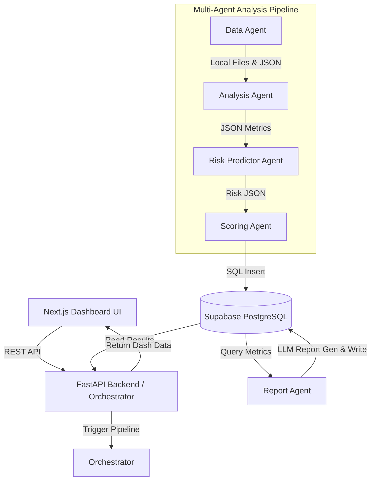

# PEIP Architecture & Agent Communications

## 1. Multi-Agent System Architecture

The Predictive Engineering Intelligence Platform (PEIP) is built strictly on a modular, multi-agent architecture. The system decomposes the massive and complex problem of "codebase risk evaluation" into 5 distinct Agent roles, sequenced by a LangChain Orchestrator. The Next.js frontend interacts only with the FastAPI Backend, decoupling the analysis workload from the user interface.

## 2. Agent Communication Protocol

In the PEIP environment, Agents **do not retain in-memory state or call each other's functions directly**. Communication happens transparently via two strict mediums:
- **Medium 1: Filesystem Handoffs (`/tmp/peip/`)** - Used for raw Git files, line-by-line analyses, and unstructured intermediate metrics. This ensures agents aren't attempting to pass massive strings through RAM.
- **Medium 2: Supabase (PostgreSQL)** - Used for finalized health scores, aggregations, schemas, and LLM text reports. This ensures the output is persistent and directly queryable by the Frontend without blocking.

**The specific handoff process is:**
1. **GitHub URL -> Orchestrator**
2. **Orchestrator -> Data Agent**: Clones the repo locally safely, stores metadata JSON.
3. **Local Directory -> Analysis Agent**: Reads files from disk, runs `Pydriller` and `Radon`, writes `analysis_output.json`.
4. **analysis_output.json -> Risk Agent**: Normalizes factors and determines risk classification. Outputs `risk_scores.json`.
5. **risk_scores.json -> Scoring Agent**: Computes `0-100` health bounds. Saves data to Supabase.
6. **Supabase -> Report Agent**: Triggers a query to fetch the scores, builds the context payload, and asks the LLM to write the "CEO" and "Developer" markdown summaries.

## 3. Mandatory MCP Interventions Overview

The agentic building tools will be utilized sequentially as follows:

| # | MCP Name | Mission Role | Specific Trigger Condition |
| :--- | :--- | :--- | :--- |
| **1** | `Context7` | Documentation & Library Sanity Checks | Activated beforehand to secure exact syntax rules for LangChain chains and PyDriller `2.x`. Prevents deprecated logic hallucinations. |
| **2** | `GitHub MCP` | Authentication & Extraction | Instead of manual API logic, natively fetching Git trees and commit hashes. Extracted metadata passes straight to the Filesystem. |
| **3** | `Filesystem MCP` | Disk Bridging | Physical mediator. Exits of `git clone` or API pulls are saved locally (e.g. `/tmp/peip/repoName`) so Radon and PyDriller can actually traverse them. |
| **4** | `Shell Execution MCP` | Script Firing & Native Analysis | Used heavily to wrap `/venv/` invocations, `radon cc`, `git clone`, and start Python scripts that output standard structured JSON responses via stdout. |
| **5** | `Sequential Thinking MCP` | Prompt Formulation Pre-Generation | Applied prior to generating complex logic trees; ensures the LLM outlines a checklist to not miss any edge case before execution. |
| **6** | `Supabase MCP` | Persistence Engine Setup | Handles raw schema application (`CREATE TABLE`) right at the start of the build phase to ready the Database bindings for the pipeline insertion. |
| **7** | `Firebase MCP` | Hosting Rollout | Captures local build directories and stages the site structure to standard public endpoints right before presentation. |

